  
    Joaquin Coaquira © 2026 Joaquin Coaquira. All rights reserved.
  

</img>

<!-- HEADER -->

  <b>Mechanical / Product Engineer</b> 
  Thermal Systems • Electro-Mechanical Design • Simulation-Driven Development

  
  
  

---

<!-- ABOUT -->
<h2 align="center">About</h2>

I design and build <b>high-performance engineering systems</b> where thermal, mechanical, and electrical constraints intersect.  
  
My work focuses on <b>high heat flux systems, liquid cooling, and electro-thermal design</b>, taking products from <b>concept → simulation → validation → production</b>.  
  
I operate at the level where <b>physics, manufacturability, and cost</b> must align — not just design in isolation.

---

<!-- ENGINEERING HIGHLIGHTS -->
<h2 align="center">Engineering Highlights</h2>

  ⚡ <b>High-Power Thermal Systems:</b> Designed resistor systems with ~100 kW heat dissipation using liquid cooling  
    ⚡ <b>Simulation-Driven Design:</b> CFD + FEA for flow distribution, pressure drop, and thermal performance  
    ⚡ <b>Precision Interfaces:</b> Tolerance stack-ups for thermal contact, compression, and reliability  
    ⚡ <b>Sealing Engineering:</b> O-ring / face seal design under pressure + thermal cycling  
    ⚡ <b>Manufacturing Optimization:</b> Reduced cost and complexity through DFM/DFA decisions  
    ⚡ <b>End-to-End Ownership:</b> Concept → analysis → prototype → production integration  

---

<!-- TOOLSET -->
<h2 align="center">Toolset</h2>

  🛠 <b>CAD:</b> SolidWorks • NX • CATIA  
    🧪 <b>Simulation:</b> ANSYS • CFD • FEA • Conjugate Heat Transfer  
    📐 <b>Engineering:</b> GD&T • Tolerance Analysis • Failure Modes  
    ⚙️ <b>Manufacturing:</b> DFM/DFA • Prototyping • Supplier Integration  

---

<!-- CONTACT -->
<h2 align="center">Contact</h2>

  📧 joaquingenaro2003@gmail.com  
    🔗 linkedin.com/in/joaquin-coaquira  

---
